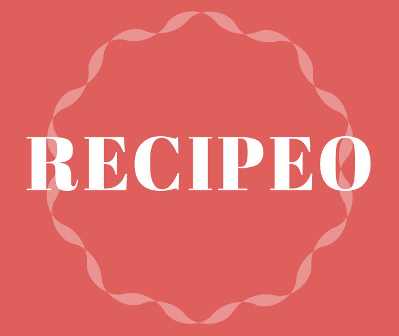

<!-- Improved compatibility of back to top link: See: https://github.com/othneildrew/Best-README-Template/pull/73 -->

<!--
*** Thanks for checking out the Best-README-Template. If you have a suggestion
*** that would make this better, please fork the repo and create a pull request
*** or simply open an issue with the tag "enhancement".
*** Don't forget to give the project a star!
*** Thanks again! Now go create something AMAZING! :D
-->

<!-- PROJECT LOGO -->
 

  

<h3 align="center">Recipeo</h3>

  

Introducing the ultimate personal recipe curation app - Recipeo! 
     
  
  

    <a href="https://github.com/lafleurss/recipeo">View Demo</a>
    ·
    <a href="https://github.com/lafleurss/recipeo/issues">Report Bug</a>
    ·
    <a href="https://github.com/lafleurss/recipeo/issues">Request Feature</a>
  

<!-- TABLE OF CONTENTS -->

  
Table of Contents

  <ol>
    <li>
      <a href="#about-the-project">About The Project</a>
      <ul>
        <li><a href="#built-with">Built With</a></li>
      </ul>
    </li>
    <li>
      <a href="#getting-started">Getting Started</a>
      <ul>
        <li><a href="#prerequisites">Prerequisites</a></li>
        <li><a href="#installation">Installation</a></li>
      </ul>
    </li>
    <li><a href="#usage">Usage</a></li>
    <li><a href="#roadmap">Roadmap</a></li>
    <li><a href="#contributing">Contributing</a></li>
    <li><a href="#license">License</a></li>
    <li><a href="#contact">Contact</a></li>
    <li><a href="#acknowledgments">Acknowledgments</a></li>
  </ol>

<!-- ABOUT THE PROJECT -->
## About The Project
Introducing the ultimate personal recipe curation app - "Recipeo"! This app allows you to easily add, edit, and organize your favorite recipes, whether it's a recipe passed down from your grandma or something you found on your favorite blog or on social media. With a user-friendly interface, you can easily search through your recipes through their recipe names or tags, edit the recipe to include your own recipe enhancements or delete recipes that you no longer need.
You can also organize your recipes by categories like Recently Used, Favorites, or your own custom Category  to organize your recipes. Say goodbye to cluttered recipe cards or lost recipe tweaks and hello to a streamlined, organized recipe collection with Recipeo.

### Features
* Users can create and save recipes
* Users can optionally assign a category to a recipe when creating one 
* Users can edit a recipe to note recipe adjustments 
* Users can see top 10 recipes in the Recent category (recently created/updated)
* Users can see all their favorite recipes in the Favorites Category 
* Users can see ALL their recipes unfiltered 
* Users can create custom Categories 
* Users can view all their custom Categories 
* Users can delete a recipe when it is no longer needed
* Users can search for recipes via tags or recipe names

(<a href="#readme-top">back to top</a>)

