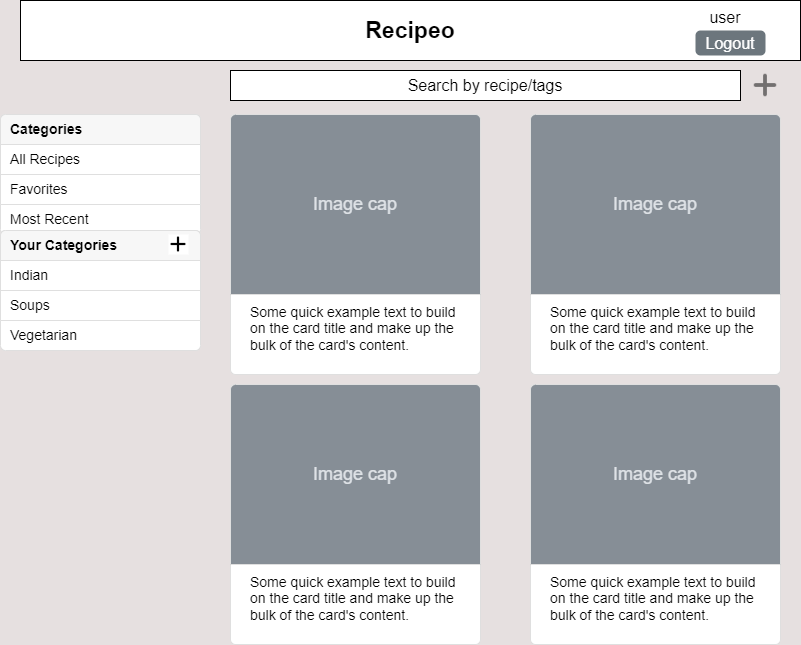

# Recipeo
Introducing the ultimate personal recipe curation app - "Recipeo"! This app allows you to easily add, edit, and organize your favorite recipes, whether it's a recipe passed down from your grandma or something you found online. With a user-friendly interface, you can easily search through your recipes through their tags, edit the recipe to include your own recipe enhancements or delete recipes that you no longer need (... because you're now a vegan!).

You can also organize your recipes by categories like Recently Used, Favorites, or your own custom Category  to organize your recipes. Say goodbye to cluttered recipe cards or lost recipe tweaks and hello to a streamlined, organized recipe collection with Recipeo.

# Business Requirements

## User Stories
1. As a user I want to be able to login to the app using Amazon Cognito
2. As a user I want to create a recipe so that I can save it
3. As a user I want to optionally assign a category to a Recipe when Creating a Recipe
4. As a user I want to edit a recipe so that I can note my recipe adjustments
5. As a user I want to be able to see top 10 recipes in my Recent category (recently created/updated)  
6. As a user I want to be able to see all recipes in my Favorites Category
7. As a user I want to be able to see ALL my recipes
8. As a user I want to be able to create my custom Categories 
9. As a user I want to be able to view all my custom Categories
10. As a user I want to Delete a Recipe when I no longer have use for it **
11. As a user I want to Search for recipes via tags

A list of “stretch goals”/features
1. As a user I want to be able to update my custom Categories
2. As a user I want to Delete a Category
3. As a user I want to be able to sort my recipes by recipe name alphabetically
4. As a user I want to be able to selectively add/remove recipes to my custom Category
5. As a user I want to be able to use JustTheRecipe api in this app to extract a recipe from any URL
6. Ability to store and display a picture for every recipe
7. Ability to invite friends, add friends and share recipes within the app
8. Create grocery lists within the app

# UML class diagram
[UML Class Diagram](images/RecipeoUMLClass.png)

# DynamoDB 
List of Tables and global secondary indexes:

### Recipe
- userId:String (Partition Key)
- recipeId:String (Sort Key)
- recipeName:String 
- servings:Integer
- prepTime:Integer
- cookTime:Integer
- totalTime:Integer
- ingredients:List<String>
- instructions:List<String>
- category:String
- tags:Set<String>
- lastAccessed:String
- isFavourite:Boolean

### Category
- userId:String (Partition key)
- categoryName:String (Sort key)

### LastAccessedRecipes (GSI)
- userId:String (Partition Key)
- lastAccessed:String (Sort Key)

# API Endpoints
## Get Recipes for User Endpoint
* Accepts GET requests to `/recipe/user/`
* Returns a list of RecipeModels created by the authenticated user.
* If the given user has not created any recipes, an empty list will be returned

## Get Recipes for User in Category Endpoint
* Accepts GET requests to `/recipe/user/:categoryName`
* Accepts a categoryName and returns a list of RecipeModels created by the authenticated user.
* If the given user has not created any recipes, an empty list will be returned

## Get Recipe Endpoint
* Accepts GET requests to `/recipe/:recipeId`
* Accepts a recipe ID and returns the corresponding RecipeModel.
  * If the given recipe ID is not found, will throw a RecipeNotFoundException

## Delete Recipe Endpoint
* Accepts DELETE requests to `/recipe/:recipeId`
* Accepts a recipe ID and returns the corresponding RecipeModel.
  * If the given recipe ID is not found, will throw a RecipeNotFoundException

## Create Recipe Endpoint
* Accepts POST requests to `/recipe`
* Accepts input to create a new recipe:
``{"recipeName":"New Recipe Name", "servings":4, "prepTime":20, "cookTime": 20, "totalTime":40, "ingredients": [ "1 cup chickpeas (dry)" , "1 large onion (finely chopped)", "Cilantro for garnish (optional)"  ], "instructions": [  "do x" , "prep y" , "another step"  ], "tags": [ "tag1", "tag2", "tag3" ], "isFavorite" : "true", "categoryName": "Uncategorized" }``
* Optional: list of tags (default: no tags), isFavorite (default: false), category (default: Uncategorized). Returns the new recipe with the lastAccessed timestamp set to time of POST, including a unique recipe ID assigned by the Recipeo service.

  * For security concerns, we will validate the provided recipe name does not contain any invalid characters: " ' \`
  * If the recipe name contains any of the invalid characters, will throw an InvalidAttributeValueException.

## Get Categories for User Endpoint
* Accepts GET requests to `/category/user`
* Returns a List of Category created by the authenticated user.
* If the given user has not created any categories, will throw a CategoryNotFoundException

## Get Category Endpoint
* Accepts GET requests to `/category/:categoryName`
* Accepts a categoryName and returns the corresponding Category.
  * If the given categoryName is not found, will throw a CategoryNotFoundException

## Create Category Endpoint
* Accepts POST requests to `/category`
* Accepts input to create a new category: `{"categoryName" : "name"}`. Returns the new category.
  * For security concerns, we will validate the provided recipe name does not contain any invalid characters: "\`
  * If the recipe name contains any of the invalid characters, will throw an InvalidAttributeValueException.

## Update Recipe Endpoint
* Accepts PUT requests to `/recipes/:recipeId`
* Accepts a recipeId and input to update a recipe ``{"recipeName":"New Recipe Name", "servings":4, "prepTime":20, "cookTime": 20, "totalTime":40, "ingredients": [ "1 cup chickpeas (dry)" , "1 large onion (finely chopped)", "Cilantro for garnish (optional)"  ], "instructions": [  "do x" , "prep y" , "another step"  ], "tags": [ "tag1", "tag2", "tag3" ], "isFavorite" : "true", "categoryName": "Uncategorized" }``. Returns the updated recipe.
  * If the recipe ID is not found, will throw a RecipeNotFoundException
  * For security concerns, we will validate the provided recipe name does not contain invalid characters: "\`
  * If the recipe name contains invalid characters, will throw an InvalidAttributeValueException

## Update Category Endpoint
* Accepts PUT requests to `/category/:categoryName`
* Accepts a categoryName and input to update a category `{"categoryName" : "name"}`.  Returns the updated Category.
  * If the categoryname is not found, will throw a CategoryNotFoundException
  * For security concerns, we will validate the provided recipe name does not contain invalid characters: "\`
  * If the category name contains invalid characters, will throw an InvalidAttributeValueException

## Search Recipes Endpoint
* Accepts GET requests to `/recipe/search`
* Accepts parameters `recipeName` or `tags` to search for recipes  using recipe names or tags. Returns a list of RecipeModel.
  * If the recipe ID is not found, will throw a RecipeNotFoundException
  * For security concerns, we will validate the provided recipe name does not contain invalid characters: "\`
  * If the recipe name contains invalid characters, will throw an InvalidAttributeValueException

# UML Sequence Diagram
[Create Recipe](images/CreateRecipe.png)

# Mockups
Mockups (aka “wireframes”) of the front-end web application
#### [Home](images/home.png)

#### [Recipe](images/recipe.png)

#### [Category](images/category.png)

# AWS Services
* CloudFormation
* S3
* CloudFront
* API Gateway
* Lambda
* Dynamo DB
